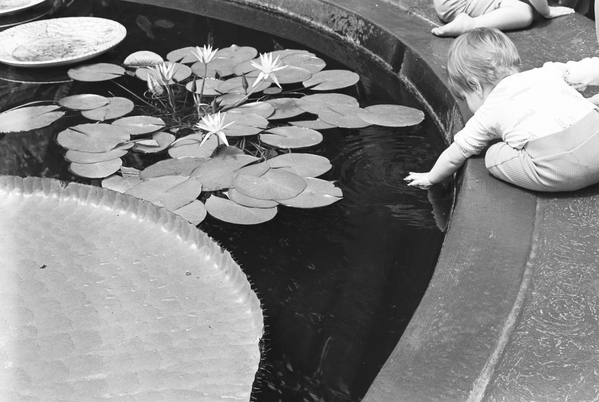
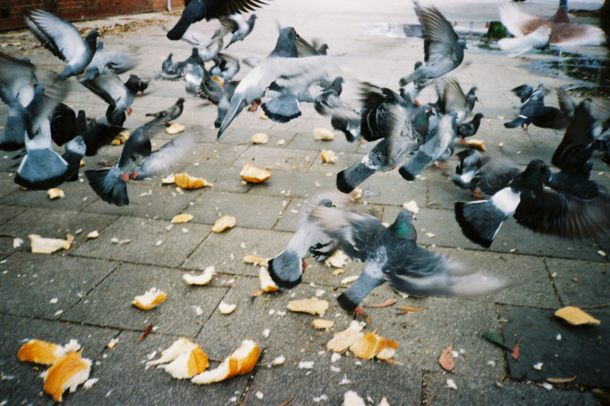

# Life updates and thoughts

So its the new year, which is a good time for introspection. To be fair i don't need an excuse to introspect, ruminate, and overthink things, but hey if i'm doing it already might as well say its because of the new year.

## New Pronouns Just Dropped???? 🔥🔥🔥🔥

So for the first time in a while I've updated my pronouns from they/them to they/she (the pull request was a pain). Coinciding with changing to shots a few months back, I've been playing with my gender again a bit, trying a few more feminine things. Starting to add 'she' feels nice in a way it didn't when I first started transitioning, we will see if it sticks.

I've often struggled to articulate my gender identity beyond non-binary, often defining it by what I'm not. Not a man, not a woman... etc...

But I guess that's informed by the models of man and woman that I have, and as that's changed and expanded I find myself identifying a little more with woman, just not in the way a cishet woman would. I still come back to [Alex Temple's description of it](https://hypocritereader.com/98/alex-temple):

> At times I’ve also listed my gender on forms as “80s” or “[Daria](http://www.dariawiki.org/wiki/index.php?title=Daria_%28TV_series%29).” These descriptions might sound inconsistent, but they’re all different ways of getting at the same idea: a kind of gender in which _unreality_ is an essential component. Many trans women would be terribly insulted by the suggestion that they are in any sense “not real women,” but my reaction to that would be “yeah, that’s kinda true” — just not for the reason that transphobic people would think it’s true.

I've got a lot more thoughts about it kicking around in my head but I'm finding it difficult to articulate them, I may get around to it at some point.

## Balance

I find it difficult to balance and separate the things happening in my life. This has worsened over the last year or two. I'm supposed to be starting my master's program this year, while also likely having my acting position at work made permanent, working through the impacts of constant health scares, and generally being in survival mode for a few years. To say I'm tired and burnt out would be an understatement. It doesn't help that i'm bored out of my fucking mind at work at the moment, though job hunting is also teriffying as I feel like my brain isn't working at the level i want it to be.

This isn't so much a commitment to balance, I just really want to be better at figuring how I'm feeling so I can tell people what I need and want.

## Body changes

So I mentioned starting shots, which have been great (also my boobs got bigger, fuck yeag!). I also shifted some other meds which has resulted in my body changing shape again. It's a weird feeling and a reminder that inhabiting a meat suit means I don't have absolute control on how it changes over time. On the plus side, I can fit into some of my old pants again, and I feel like my body is *moving* better, my climbing feels nicer and I'm getting stronger.

## Photography 

I continue to dive down the photography rabbit hole. With the help of my dad, I've recently learnt to develop my own film. It's a really nice experience and the negatives hanging in the bathroom is kind of a vibe. So I'm just churning through rolls of film, shoutout tmax400 tbh.

I've also started trying to absorb as much work from other photographers I like. Recently I picked up *HK:PM* from Greg Girard. It's a collection of photos of Hong Kong over a 10 year period in the 70s/80s and it's gorgeous. Cyberpunk before it was cyberpunk. Some of the photos i've taken over the last year can be found below.

## Friends

I consider myself extraordinarily lucky to have the people in my life that I do. Plus I'm slowly learning that they like me as a person and not just for my dumb jokes and cunty cheekbones (see that was using irony to diffuse vulnerability). It's strange to think of myself as a person people actively enjoy spending time with, but i can't begin to articulate how nice it has been. It also serves as a reminder to tell my friends how glad I am to know them, especially ones who i don't see as often as i'd like due to things like distance and time. I suspect at least one of my interstate friends reads these, so if you do, I can't wait to give you a hug in August.

## Closing thoughts

If you made it this far, thanks for reading. Sorry these feel kind of melancholic at the moment, its been a tough year. I genuinely am doing better than i have been i promise!!!!