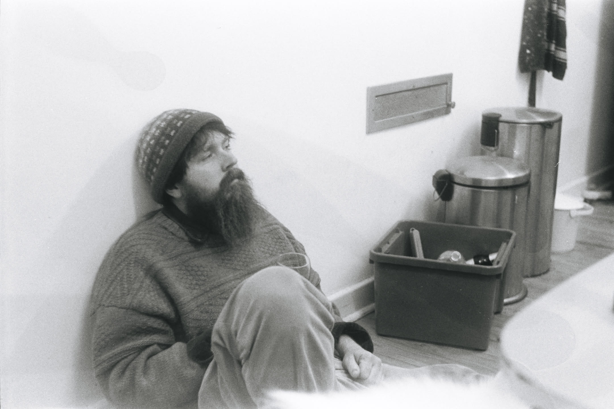
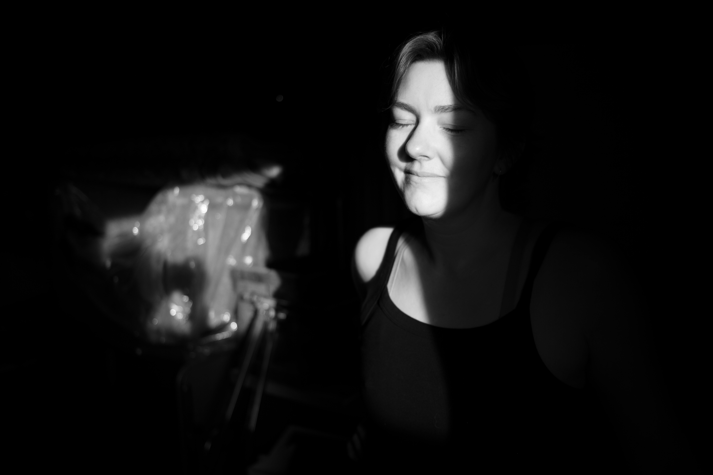

# On Photographic Medium

For the past two or so years, most of my photography has been on film. Thats not so much a measure of volume, but rather the photos that I feel like I have connected with and enjoyed taking. I have several digital cameras, one of which (an Olympus Pen F) I do shoot with fairly often. I still never feel like i've '*connected*' with that camera, where 'connected' here is followed by a lot of hand waving and general vibes.

I enjoy the process of shooting film from beginning to end, its a more deliberate process with more limiting tools and I enjoy the images I make at the end far more. I have much more emotional connection to more of my film photos than the ones I take on digital.

However, the cost of film continues to climb (especially with the rapidly increasing rate at which i am going through rolls). Although bulk rolling, and learning to develop have mitigated that somewhat, the cost of purchase, scanning and colour development continues to be a gnawing hole in my monthly budget.

My aversion to digital is also partly because I have a great distaste for editing. My monitor isn't well calibrated (and to do so requires tools), and part of the reason I love photography as a hobby is that it reduced my time in front of a screen... Editing requires significant screen time to both learn properly and do.

## Dipping a toe

A few weeks ago, after a particularly shitty week, I purchased a cheap Yashica YL rangefinder from an op shop ($30, a bargain!).

I quickly adjusted to the rangefinder experience, enjoying being able to see more through the viewfinder than just the frame that would be taken. The camera being completely manual forced me to take an ambient light reading and adjust from there with each shot. a work flow that then allowed zone focusing to become much more natural.

A combination of film slowing me down and forcing me to consider my compositions, and the camera workflow encouraging a kind of "flow" state, I made some of my favourite images to date. And ohhhhh my god, the gentle *click* of the leaf shutter on the yashy is so delightful.

the lens - an old design - is kind of scuffed, leading to this dreamy vibe seem below:

## Gear Acquisition Syndrome

Gear acquisition syndrome is an in joke in many hobbyist circles. It implies that the sufferer enjoys collecting and purchasing new items more than the usage of them, or that the next thing will be the game changer (spoiler: it rarely is). There is rarely, if ever, going to be a new piece of equipment that slightly outperforms the old one that uplifts your experience of a practice to new heights. Higher megapixel counts, IBIS, a faster/sharper lens... None of these will make me a better photographer. Car enthusiasts like to say that often the best modification you can do is 'driver mod', which basically means get better at driving before you consider upgrading your car.

With that in mind, I *don't* think that purchasing new equipment is inherently bad, even if you haven't extracted every last ounce out of your existing kit. After experiencing the joy of shooting film with a rangefinder, and in the context of wanting to spend less on film itself, I made the very sensible financial decision to purchase an older, very beat up, Leica M-P Typ 240. I've named her Emma. An objectively worse camera than anything else i could spend the same money on equipment wise.

My conclusion i've kind of reached with gear is that you should own the things that make you _want_ to use them, and dear god does this camera make me want to carry it with me all day and hit that shutter button until it stops working.

## Enjoyment

So when I think about what I enjoy about film, and how I can get that experience in other ways, while also imposing similar limitations on myself, the only option is really Leica (please someone make a digital camera like them but cheaper). Sure I could adapt some of my manual lenses to a fuji or sony body, but then the temptation to spend more time diving into menus and fiddling is going to be there. And I know myself well enough that if I have the opportunity to fiddle, i'll spend all day doing it until I hate what the object represents. 

I think arguments about specifications completely miss the point for anyone other than professionals who actually see the benefits from expanded and improved feature sets. I'm not a professional photographer and i don't want to be. For me new equipment should open up a new way to have fun! Limitations should force me to think harder and be more creative with what I can do. 

I mentioned earlier about feeling connected to a camera, and I realise that this is a concept that is ambiguous and hard to define. It will vary from person to person, and the tools that they use. I think attempting to be prescriptive about what it is to me defeats the point, setting out a list of features and comparing them isn't really going to tell me if I enjoy using an object. Maybe i can add 'feels nice to hold' or 'nice shutter sound', but then how do you define those? Regardless, a general theme for me is mechanical use, i like using objects that have a certain tactility and feedback to them. 

## Emma

How do i describe a camera to me?

I never considered myself to be a particularly sentimental person, but over the last few years that has changed considerably. My partner often talks about objects as containers of memory, especially ones that demonstrate their usage over time through wear and tear. I think this goes doubley for a camera, an object whose sole purpose is to make images, to make memories. My relationship to each camera is related to the memories that each one has been present for, whether the memories are mine or not.

Emma has seen her share of use, she arrived with some pretty significant paint loss, revealing the brass underneath. Indicative of an object that was well used, or at least well travelled. It does make me wonder what she's been through, and why the previous owner decided to sell her. I look forward to adding more scuffs and patina to her.

I feel like i've captured more joy with this new camera than I have with some of my others. I'm not sure if its a change in my life circumstances (i doubt it the last few months have been so stressful); a change in the things I've wanted to photograph; or the way this camera forces me to use it. Rangefinders do not see through the lens as a mirrorless or slr type camera would. instead they present an abstracted view, a rough estimation of what the lens sees. 

Am i abstracting myself more as a result? it doesn't feel like it, i do feel more connected to this camera than say my Pen-F Digital.... but its definitely something that i'm sure I will ponder more without ever reaching any meaningfull conclusion. 

I will say i'm finding myself experimenting with more colour photography, though I still think the kind of things my eye is drawn too are often more suitable for black and white. If I ever change or acquire another leica i imagine it will likely be one of their monochrom cameras. 

Here's a few photos from the last couple of months from her.

